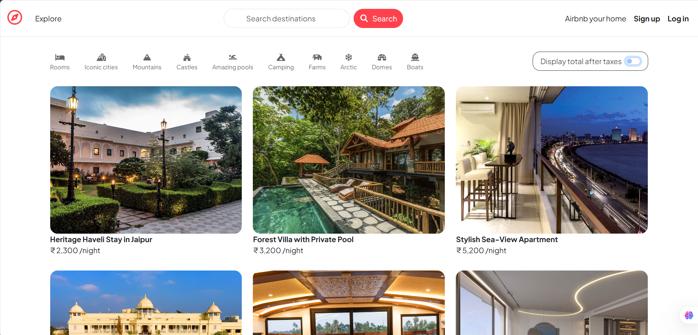
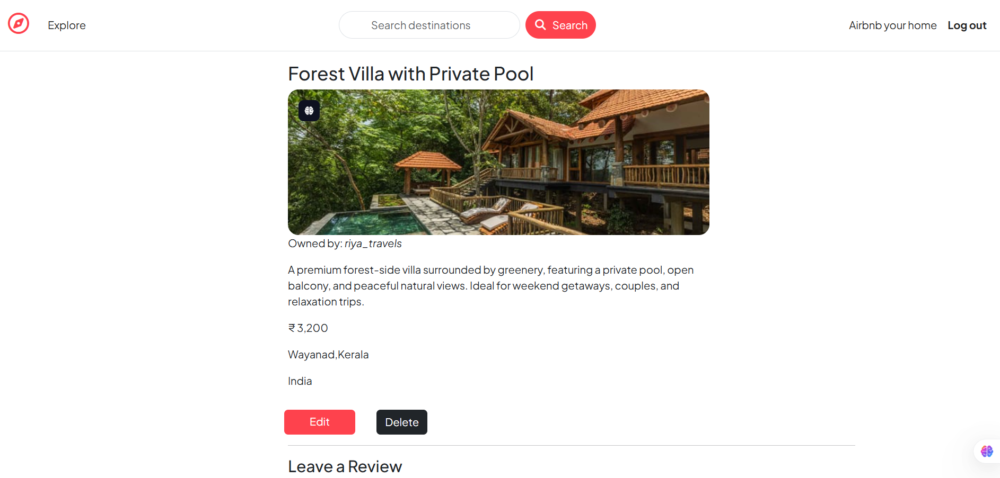
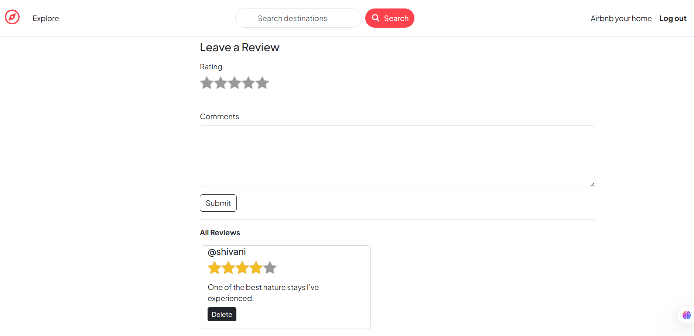
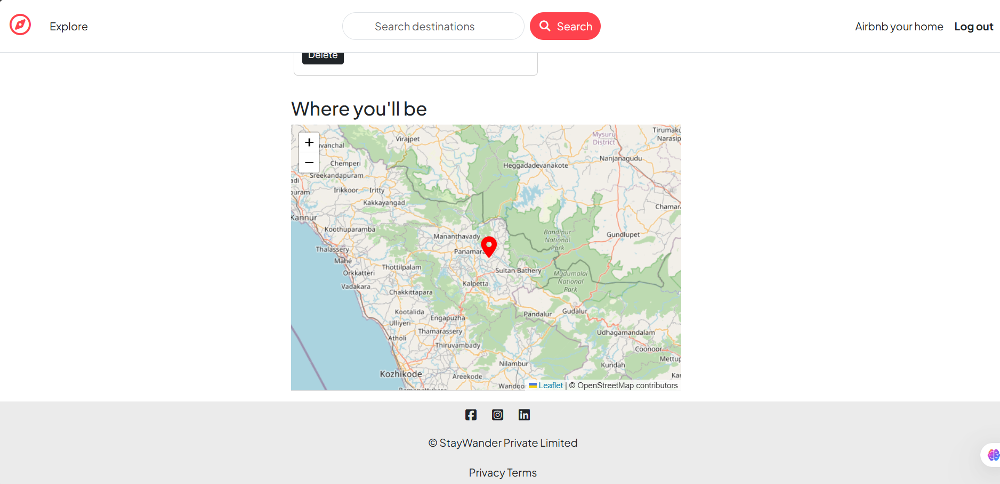

# 🏡 StayWander — Full Stack Accommodation Platform

StayWander is a modern full-stack accommodation platform designed to simulate a real-world stay discovery and listing system. It blends strong backend engineering with a smooth user experience, enabling users to create listings, upload images, explore locations on interactive maps, and share reviews in a secure, production-style environment.

🔗 Live Demo: https://staywander-rz7m.onrender.com/listings

---

## ✨ Key Features

- 🔐 User authentication & authorization (Login / Signup)
- 🏠 Create, edit & delete property listings (owner-only access)
- 🖼 Image upload with Cloudinary integration
- 🗺 Location search with OpenStreetMap geocoding & Leaflet maps
- 📝 Reviews & ratings system
- 🔍 Search and category-based filtering
- ⚠ Robust validation & custom error handling
- ☁ Deployed on Render with MongoDB Atlas

---

## 🖥 Tech Stack

**Frontend:** EJS, HTML5, CSS3, Bootstrap  
**Backend:** Node.js, Express.js (MVC Architecture)  
**Database:** MongoDB Atlas, Mongoose  
**Authentication:** Passport.js, Sessions, Cookies  
**Integrations:** Cloudinary, Multer, Joi, OpenStreetMap (Nominatim), Leaflet.js  
**Deployment:** Render, MongoDB Atlas (GitHub auto-deploy, environment-based config)

---

## 📸 Screenshots

  
  

  
  

---

## 🧠 Architecture & Engineering Highlights

- Implemented full **MVC architecture** with clean separation of concerns
- Designed **Mongoose schemas & relationships** (Users, Listings, Reviews)
- Built **secure authentication & owner-based authorization**
- Integrated **external APIs** for maps and geocoding
- Added **Joi validation** and **custom Express error handling**
- Configured **production-ready deployment** with environment variables

---

## 🎯 Why this project matters

This project showcases my ability to design and build **production-oriented full stack systems** with a strong focus on scalability, security, and real-world use cases.

It demonstrates hands-on experience in:

- Backend system design & MVC architecture
- Secure authentication, authorization, and session handling
- Cloud services and third-party API integrations
- Database schema design and relationships
- Deployment workflows and environment configuration

---

## 👩‍💻 Developer

**Darshna Shingavi**  
Aspiring Software Engineer | Full Stack Developer

📧 Email: darshnashingavi21@gmail.com  
🔗 LinkedIn: https://linkedin.com/in/darshna-shingavi-a414882b6  
🔗 GitHub: https://github.com/darshna21-bit
